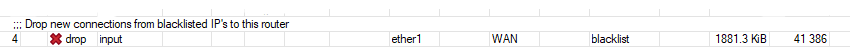

<a href="#"></a>
<a href="#"></a>
[](https://mikrotik.com/download/changelogs/)
# MikroTik Automatically Updated Address List
### A Problem
When you offer public access to a service it can be rather difficult to separate the bad connections from the good.

### A Solution
MikroTik to the rescue with address lists… simply put the bad addresses in a list and block anything in the list. Sounds like fun right… or maybe not so much? Of course you can (and should) manually create rules to detect abuse and dynamically create the lists… However there is more that you can do, you can subscribe to lists that are maintained by others like Spamhaus, dshield,

### Example of a parsed list
Generated by Serp07 on 2024-02-24 01:59:30   
/ip firewall address-list   
add list=blacklist address=1.4.0.0/17 comment=SpamHaus   
add list=blacklist address=1.10.16.0/20 comment=SpamHaus   
add list=blacklist address=1.116.0.0/14 comment=SpamHaus   
...
### Implementation
The implementation is simple... paste the following code into the terminal of any MikroTik and your router will grabthe newest copy of my script file and run it regular basis.    

### [For RouterOs v6.xx  ](updater_list_script_for_v6.xx.rsc)

```
/system scheduler
add comment="Apply combined List" interval=1d name=Update_combined on-event=Updater_List policy=\
    ftp,reboot,read,write,policy,test,password,sniff,sensitive,romon start-date=feb/24/2024 start-time=20:08:41
/system script
add dont-require-permissions=no name=Updater_List owner=admin policy=\
    ftp,reboot,read,write,policy,test,password,sniff,sensitive,romon source="/tool fetch url=\"https://raw.githubusercontent.co\
    m/Serp07/updater_list_for_mikrotik/main/combined.rsc\" mode=https dst-path=combined.rsc;\
    \n\r\
    \n\r\
    \n:log info \"Downloaded autoaddresslist from github/Serp07 \";\r\
    \n\r\
    \n/ip firewall address-list remove [find where comment=\"Auto_address_List\"];\r\
    \n/ip firewall address-list remove [find where comment=\"Bruteforce_Blocker\"];\r\
    \n\
    \n\r\
    \n:log info \"Removed old autoaddresslist records and imported new list\";\r\
    \n\
    \n\r\
    \n/import file-name=combined.rsc;\r\
    \n\r\
    \n#/file/remove combined.rsc"
/ip firewall filter
add action=drop chain=input comment="Drop new connections from blacklisted IP's to this router" connection-state=new \
    in-interface=ether1 in-interface-list=WAN src-address-list=blacklist

```

### [For RouterOs v7.xx  ](updater_list_script_for_v7.xx.rsc)

```
/system scheduler
add comment="Apply combined List" interval=1d name=Update_combined on-event=\
    Updater_List policy=\
    ftp,reboot,read,write,policy,test,password,sniff,sensitive,romon \
    start-date=2024-02-24 start-time=15:50:16
/system script
add dont-require-permissions=no name=Updater_List owner=admin policy=\
    ftp,reboot,read,write,policy,test,password,sniff,sensitive,romon source="/tool/fetch url=\"https://raw.githubuserc\
    ontent.com/Serp07/updater_list_for_mikrotik/main/combined.rsc\" mode=https dst-path=combined.rsc;\
    \n\r\
    \n:log info \"Downloaded autoaddresslist from github/Serp07 \";\r\
    \n/ip/firewall/address-list/remove [find where comment=\"Auto_address_List\"&\"Bruteforce_Blocker\"]\
    \n/import file-name=combined.rsc;\r\
    \n\
    \n:log info \"Removed old autoaddresslist records and imported new list\";\r\
    \n\
    \n#/file/remove combined.rsc"

/ip firewall filter
add action=drop chain=input comment="Drop new connections from blacklisted IP's to this router" connection-state=new \
    in-interface=ether1 in-interface-list=WAN src-address-list=blacklist

```
The following will not block anything, it only adds IP’s to your address list. You will still have to create a firewall rule which will match src-address-list=blacklist and drop the traffic in your input and/or forward chains.
In order to use any of the following lists you will want to add a rule to your input or forward chains like the following:

add chain=input action=drop comment="Drop new connections from blacklisted IP's to this router" \
    connection-state=new src-address-list=blacklist in-interface=ether1-Internet

# Result


